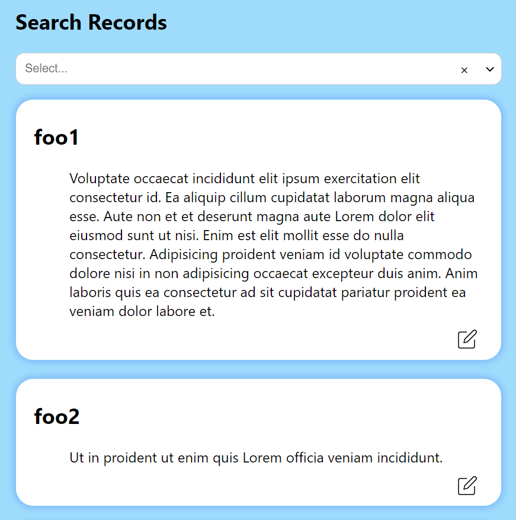

# React Record Manager
A simple and flexible record manager built with React.js.

[Live Demo](https://ecspecial.github.io/data-editor/) available.

### Project overview


## Features
- View a list of records
- Search through records using a dropdown selection
- Edit the value of a record and save changes
- Show a warning alert when the input is empty


## Local Setup
### Prerequisites
- Node.js and npm

1. Clone the repository to your local machine.
2. Navigate to the project directory and install dependencies.
3. Start using following commands:


```shell 
npm run start
```

## Tech Stack
React.js
react-dropdown-select
CSS